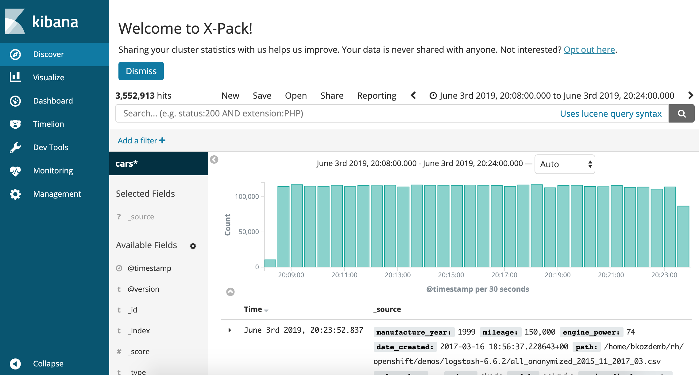

# elk-demo

How I deployed a single node ElasticSearch, Logstash, Kibana (EFK) stack on OpenShift. This is for demonstration purposes and is not a supported document. To deploy EFK at scale, you'll want to follow the [Elastic Cloud on Kubernetes](https://operatorhub.io/operator/elastic-cloud-eck) operator. 

### Node configuration

The Elastic Search container requires a kernel parameter to be tuned on the OpenShift
worker nodes.

```
sudo sysctl vm.max_map_count=262144
```

Login to the OpenShift API server and create a new project.

```
oc login https://api.example.com 
PROJ=elk
oc new-project elk
```

### ElasticSearch 

Use the OpenShift client to deploy the container from ElasticSearch's registry.

```
oc new-app docker.elastic.co/elasticsearch/elasticsearch:6.8.0
```

Add persistent storage (5GB minimum).

```
oc set volume dc/elasticsearch --add --mount-path=/usr/share/elasticsearch/data --claim-size=10G --claim-class=glusterfs-storage-block
```

Create a route.

```
oc expose svc elasticsearch
```

Save the ElasticSearch route.

```
ES_ROUTE=$(oc get route --selector=app=elasticsearch --output=custom-columns=NAME:.spec.host --no-headers)
```

Confirm the ElasticSearch pod is running and ready.

```
oc get pods
```

Example Output.

```
NAME                    READY     STATUS    RESTARTS   AGE
elasticsearch-2-jn49t   1/1       Running   9          19d
```

Test the ElasticSearch endpoint.

```
curl ${ES_ROUTE}
```

Example output.

```
{
  "name" : "-X-G1Wk",
  "cluster_name" : "docker-cluster",
  "cluster_uuid" : "1mX4vApHQY-wKmPUBv9U4g",
  "version" : {
    "number" : "6.0.1",
    "build_hash" : "601be4a",
    "build_date" : "2017-12-04T09:29:09.525Z",
    "build_snapshot" : false,
    "lucene_version" : "7.0.1",
    "minimum_wire_compatibility_version" : "5.6.0",
    "minimum_index_compatibility_version" : "5.0.0"
  },
  "tagline" : "You Know, for Search"
}
```

### Kibana

Use the OpenShift client to deploy the Kibana container with. The ```ELASTICSEARCH_URL``` variable gets set to
the Kubernetes serivce name of the ElasticSearch database. This allows the Kibana pod to **discover** the 
ElasticSearch service.

```
oc new-app docker.elastic.co/kibana/kibana:6.8.0 -e ELASTICSEARCH_URL=http://elasticsearch.elk.svc.cluster.local:9200
```

Add persistent storage.

```
oc set volume dc/kibana --add --mount-path=/usr/share/kibana/data --claim-size=1G
```

Expose the Kibana service as an OpenShift route.

```
oc expose svc kibana
```

Save the Kibana route.

```
KIBANA_ROUTE=$(oc get route --selector=app=kibana --output=custom-columns=NAME:.spec.host --no-headers)
```

Confirm the Kibana pod is running and ready.

```
oc get pods
```

Example Output.

```
NAME                    READY     STATUS    RESTARTS   AGE
elasticsearch-2-jn49t   1/1       Running   9          19d
kibana-3-vwxxj          1/1       Running   0          18d
```

### LogStash

To get data into ElasticSearch, use the LogStash client for your operating system of choice. This
example should work for Linux or MacOS systems.

```
wget https://artifacts.elastic.co/downloads/logstash/logstash-6.6.2.tar.gz

tar zxf logstash-6.6.2.tar.gz
```

Download the sample data from https://www.kaggle.com/mirosval/personal-cars-classifieds 

```
unzip classified-ads-for-cars.zip
```

Edit ```logstash-load-csv.conf``` as follows. 

Input Section

-> The ```path``` variable should point to the CSV file.

Output Section

-> The ```hosts``` variable should be set to the external ElasticSearch route defined in OpenShift.

Now run LogStash to upload the cars data into elastic search. This could take several minutes.

```
bin/logstash -f logstash-load-csv.conf > /dev/null 2>&1 &
```

Watch the progress.

```
curl -XPOST "http://${ES_ROUTE}:80/cars/_count?pretty"
```

Expected output.

```
{
  "count" : 3552913,
  "_shards" : {
    "total" : 5,
    "successful" : 5,
    "skipped" : 0,
    "failed" : 0
  }
}
```

#### Kibana visualization.

* Visit the Kibana console (${KIBANA_ROUTE})
* -> Discover
* Change the index pattern from ```logstash-*``` to ```cars*```
* Set the time filter field to ```@timestamp```
* -> Create Index Pattern



* Visualize -> Create visualization -> Pie
* Choose the ```cars*``` index
* Split Slices -> Aggregation -> ```Terms```
* Field -> ```maker.keyword```
* Descend -> Size = ```30```
* Choose the "Play/Apply changes" button

