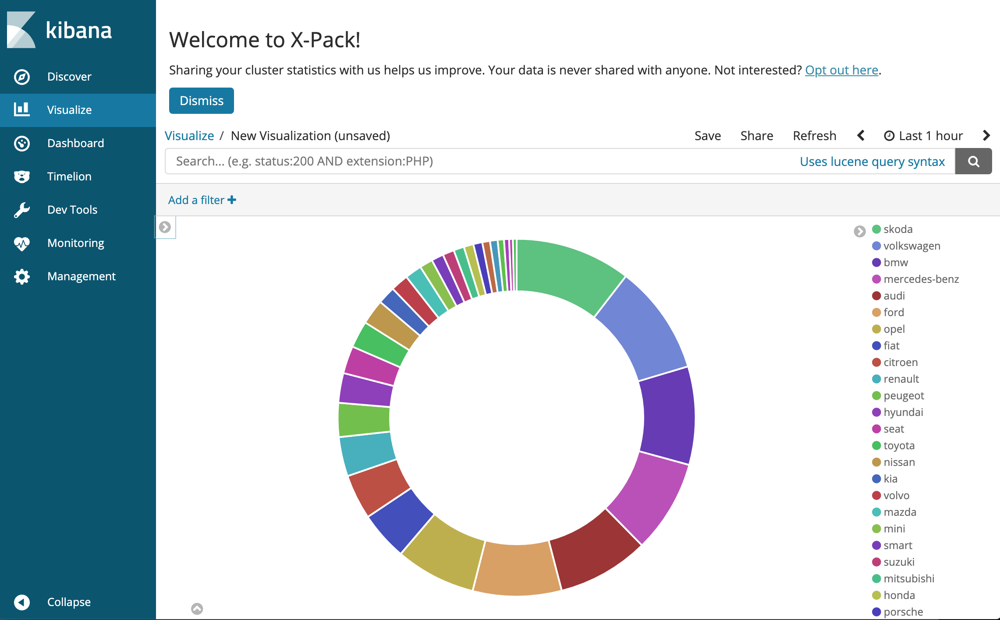

# elk-demo

Deploy an ElasticSearch, Logstash, Kibana stack on OpenShift.

### Node configuration

The Elastic Search container requires a kernel parameter to be changed on the OpenShift
worker nodes.

```
sudo sysctl vm.max_map_count=262144
```

Login to the OpenShift API server and create a new project.

```
oc login https://api.example.com 
oc new-project elk
```

### ElasticSearch 

Use the OpenShift client to deploy the container from ElasticSearch's registry, attach persistent storage and 
expose the service by creating a route.

```
oc new-app docker.elastic.co/elasticsearch/elasticsearch:6.0.1
oc set volume dc/elasticsearch --add --mount-path=/usr/share/elasticsearch/data --claim-size=10G
oc expose svc elasticsearch
```

Test connectivity through the router.

Obtain the external route.

```
oc get routes
```

```
NAME            HOST/PORT                                       PATH      SERVICES        PORT       TERMINATION   WILDCARD
elasticsearch   elasticsearch-elk.apps.example.com             elasticsearch   9200-tcp                 None
```

```
ES_ROUTE=elasticsearch-elk.apps.example.com
```

Confirm the ElasticSearch pod is running and ready.

```
oc get pods
```

Expected Output.

```
NAME                    READY     STATUS    RESTARTS   AGE
elasticsearch-2-jn49t   1/1       Running   9          19d
```

Test the ElasticSearch endpoint.

```
curl 'http://elasticsearch-elk.apps.example.com'
```

Expected output.

```
{
  "name" : "-X-G1Wk",
  "cluster_name" : "docker-cluster",
  "cluster_uuid" : "1mX4vApHQY-wKmPUBv9U4g",
  "version" : {
    "number" : "6.0.1",
    "build_hash" : "601be4a",
    "build_date" : "2017-12-04T09:29:09.525Z",
    "build_snapshot" : false,
    "lucene_version" : "7.0.1",
    "minimum_wire_compatibility_version" : "5.6.0",
    "minimum_index_compatibility_version" : "5.0.0"
  },
  "tagline" : "You Know, for Search"
}
```

### Kibana

Allow this project to run containers with any uid. This command requires cluster admin privileges.

```
oc adm policy add-scc-to-user anyuid -z default -n $PROJ
```

Use the OpenShift client to deploy the Kibana container with. The ```ELASTICSEARCH_URL``` variable gets set to
the Kubernetes serivce name of the ElasticSearch database. This allows the Kibana pod to **discover** the 
ElasticSearch service.

```
oc new-app docker.elastic.co/kibana/kibana:6.0.1 -e ELASTICSEARCH_URL=http://elasticsearch.elk.svc.cluster.local:9200
```

Next add persistent storage.

```
oc set volume dc/kibana --add --mount-path=/usr/share/kibana/data --claim-size=1G
```

Finally, expose the Kibana service as an OpenShift route.

```
$ oc expose svc kibana
```

```
$ oc get route kibana
```

Expected output.

```
NAME      HOST/PORT                                PATH      SERVICES   PORT       TERMINATION   WILDCARD
kibana    kibana-elk.apps.example.com             kibana     5601-tcp                 None
```

Confirm the Kibana pod is running and ready.

```
oc get pods
```

Expected Output.

```
NAME                    READY     STATUS    RESTARTS   AGE
elasticsearch-2-jn49t   1/1       Running   9          19d
kibana-3-vwxxj          1/1       Running   0          18d
```

### LogStash

To get data into ElasticSearch, use the LogStash client for your operating system of choice. This
example should work for Linux or MacOS systems.

```
wget https://artifacts.elastic.co/downloads/logstash/logstash-6.6.2.tar.gz

tar zxf logstash-6.6.2.tar.gz
```

Download some sample data.

```
wget https://www.kaggle.com/mirosval/personal-cars-classifieds

unzip classified-ads-for-cars.zip
```

Edit ```logstash-load-csv.conf``` as follows. 

The ```path``` variable should point to where the CSV file is located.

The ```hosts``` variable should be set to the external ElasticSearch route defined in OpenShift.

Let LogStash upload the cars data into elastic search. This could take several minutes.

```
bin/logstash -f logstash-load-csv.conf > /dev/null 2>&1 &
```

Watch the progress.

```
curl -XPOST "http://${ROUTE}:80/cars/_count?pretty"
```

Example output.

```
{
  "count" : 3567913,
  "_shards" : {
    "total" : 5,
    "successful" : 5,
    "skipped" : 0,
    "failed" : 0
  }
}
```

Example query. How many ford cars are found?

```
curl -XPOST "${ES_ROUTE}:80/cars/_count?pretty" -H 'Content-Type: application/json' -d '
  {
     "query": {
        "query_string": {
            "query": "ford"
          }
       }
  }'
  ```

  The output should resemble.

```
{
  "count" : 4529,
  "_shards" : {
    "total" : 5,
    "successful" : 4,
    "skipped" : 0,
    "failed" : 0
  }
}
```

#### Add a pie-chart visualization.

* Visit the kibana console (http://kibana-elk.apps.example.com)
* Configure the index pattern to be cars*
* Create
* Visualize->Create visualization
* Pie
* Choose the cars* index
* Split Slices -> Aggregation -> Terms
* Field -> maker.keyword
* Descend -> Size = 30
* Choose the "play/Apply changes" button

